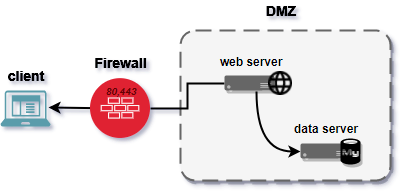
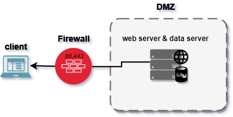
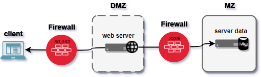
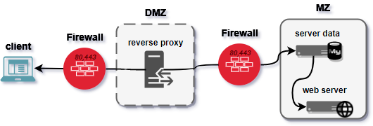

# Environnement réseau

## Important

La base de donné est un élement critique et sensible d'un architecture pour ces 2 raisons:

> - Il n'est pas conçu pour se protéger efficacement des attaques
> - il contient des données, c'est à dire la seule information pérenne dans notre architecture

**C'est pour cela qu'il faut l'isoler au maximum :** 

## à ne pas faire

## à ne pas faire non plus

## bien de faire

## meilleur chose à faire

